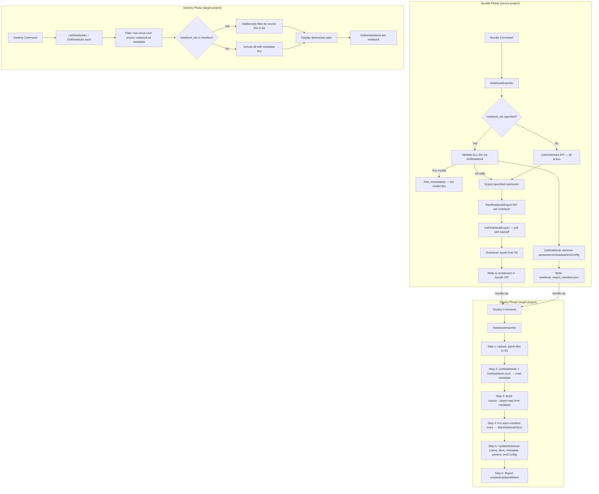

# Design Document: Data Notebooks Support

## Overview

This feature adds native Data Notebooks support to the SMUS CI/CD CLI, enabling promotion of SageMaker Unified Studio notebooks across environments (dev → test → prod) using the DataZone Notebook APIs. The implementation follows the existing CLI architecture patterns — specifically mirroring the catalog import/export approach — with two new helper modules (`notebook_export.py` and `notebook_import.py`) and integration into the existing `bundle`, `deploy`, `destroy`, and `dry-run` commands.

### Design Goals

- **Consistency**: Follow the same module structure, error handling, and reporting patterns established by the catalog import/export feature
- **Resilience**: Individual notebook failures do not block the entire export/import operation; failures are collected and reported
- **In-Place Updates**: `StartNotebookSync` handles both create and update — no delete-old-version flow. Run history is preserved across deployments
- **Metadata Tracking**: Target notebooks are tagged with `smus-cicd-source-notebook-id` to maintain source-to-target mapping via `UpdateNotebook`
- **Idempotency**: Import operations use client tokens to prevent duplicate notebook creation on retries
- **Fail-Fast Validation**: When `notebook_ids` is specified, all IDs are validated upfront via `GetNotebook` before any exports begin
- **Extensibility**: The `content.notebooks` manifest section and `deployment_configuration.notebooks` section follow the same convention as `content.catalog` and `deployment_configuration.catalog`

### Key Design Decisions

1. **StartNotebookSync replaces StartNotebookImport** — single API for both create (no notebookId) and update (with notebookId). No delete-old-version flow. Preserves run history.
2. **Notebook ID-only operation** — manifest uses `notebook_ids` list (optional). No include_names/exclude_names. No name-based filtering anywhere.
3. **Separate helper modules** rather than embedding logic in command files — follows `catalog_export.py` / `catalog_import.py` pattern
4. **JSON manifest inside the bundle** (`notebooks/notebook_export_manifest.json`) — mirrors `catalog/catalog_export.json` approach
5. **Async polling with exponential backoff** for export (GetNotebookExport) — avoids hammering APIs
6. **Notebook ID used directly for file paths** — the notebook ID (pattern: `[a-zA-Z0-9_-]{1,36}`) is inherently safe for both filesystem and S3 key usage
7. **Add `notebook` resource type** to the existing `DEPLOY_RESOURCE_TYPES` / `DESTROY_SUPPORTED_RESOURCE_TYPES` registries for destroy support
8. **Metadata-based source tracking** — deploy discovers existing target notebooks via ListNotebooks + GetNotebook, checks for `smus-cicd-source-notebook-id` in metadata
9. **No unique name enforcement** — IDs are unique by definition; duplicate names are allowed in DataZone
10. **UpdateNotebook failure = FAILED** — no separate warning category; if metadata/config porting fails, the notebook counts as failed


---

## Architecture

### High-Level Data Flow



### Module Placement

```
src/smus_cicd/
├── helpers/
│   ├── notebook_export.py          # NEW: Notebook export logic for bundle
│   ├── notebook_import.py          # NEW: Notebook sync logic for deploy
│   └── ...
├── commands/
│   ├── bundle.py                   # MODIFIED: call notebook_export when enabled
│   ├── deploy.py                   # MODIFIED: call notebook_import after catalog
│   ├── destroy.py                  # MODIFIED: (via destroy_validator/executor)
│   └── dry_run/
│       └── checkers/
│           └── notebook_checker.py # NEW: Dry-run validation for notebooks
├── application/
│   └── application_manifest.py     # MODIFIED: add NotebookConfig dataclass
└── resource_types.py               # MODIFIED: add "notebook" resource type
```

### Integration Points

| Command | Integration Point | Action |
|---------|-------------------|--------|
| `bundle` | After catalog export | Call `export_notebooks()` if `content.notebooks.enabled` |
| `deploy` | After catalog import, before bootstrap | Call `sync_notebooks()` if manifest present and not disabled |
| `destroy` | Validation phase | ListNotebooks + GetNotebook → filter by metadata → optional `notebook_ids` filter |
| `destroy` | Execution phase | DeleteNotebook for each filtered notebook |
| `dry-run` | After catalog checker | `NotebookChecker.check()` validates prerequisites |

---

## Components and Interfaces

### 1. Manifest Configuration (`application_manifest.py`)

New dataclass for the `content.notebooks` section:

```python
@dataclass
class NotebookConfig:
    """Notebook export configuration for bundle."""
    enabled: bool = False
    notebook_ids: Optional[List[str]] = None  # Optional list of notebook IDs to export
    # Pattern per ID: [a-zA-Z0-9_-]{1,36}
```

**Parsing**: Added to `ContentConfig`:

```python
@dataclass
class ContentConfig:
    storage: List[StorageConfig] = field(default_factory=list)
    git: List[GitContentConfig] = field(default_factory=list)
    catalog: Optional[CatalogConfig] = None
    notebooks: Optional[NotebookConfig] = None  # NEW
    quicksight: List[QuickSightDashboardConfig] = field(default_factory=list)
    workflows: List[Dict[str, Any]] = field(default_factory=list)
```

**Deployment configuration** (per-stage disable):

```python
@dataclass
class DeploymentConfiguration:
    storage: List[StorageConfig] = field(default_factory=list)
    git: List[GitTargetConfig] = field(default_factory=list)
    catalog: Optional[Dict[str, Any]] = None
    notebooks: Optional[Dict[str, Any]] = None  # NEW: {"disable": bool}
    quicksight: Optional[Dict[str, Any]] = None
```

### 2. NotebookExporter (`helpers/notebook_export.py`)

```python
def export_notebooks(
    domain_id: str,
    project_id: str,
    region: str,
    notebook_ids: Optional[List[str]] = None,
    polling_timeout: int = 300,
) -> Tuple[List[ExportedNotebook], Dict[str, Any]]:
    """
    Export notebooks from a DataZone project.

    If notebook_ids is specified:
      1. Validate ALL IDs upfront via GetNotebook (fail-fast)
      2. If any ID is invalid, fail immediately listing all invalid IDs
      3. If all valid, export only those notebooks

    If notebook_ids is omitted:
      1. Call ListNotebooks to discover all active notebooks
      2. Export all discovered notebooks

    Args:
        domain_id: DataZone domain identifier
        project_id: DataZone project identifier
        region: AWS region
        notebook_ids: Optional list of specific notebook IDs to export
        polling_timeout: Max seconds to wait per notebook export (default 300)

    Returns:
        Tuple of (list of exported notebook objects, manifest dict)

    Raises:
        Exception: If ListNotebooks API fails entirely
        SystemExit: If any notebook_ids are invalid (fail-fast)
    """
```

**Internal functions:**

```python
def _validate_notebook_ids(
    client, domain_id: str, notebook_ids: List[str],
) -> Tuple[List[Dict], List[str]]:
    """Validate ALL notebook IDs upfront via GetNotebook.
    Returns (valid_notebooks_with_details, invalid_ids).
    Calls GetNotebook for EACH ID — retrieves parameters, metadata, envConfig."""

def _list_all_notebooks(client, domain_id: str, project_id: str) -> List[Dict]:
    """List all active notebooks with pagination (follows nextToken)."""

def _export_single_notebook(
    client, s3_client, domain_id: str, project_id: str,
    notebook: Dict, polling_timeout: int,
) -> Optional[ExportedNotebook]:
    """Export a single notebook: StartNotebookExport → poll → download."""

def _poll_export_status(
    client, domain_id: str, export_id: str, notebook_id: str,
    polling_timeout: int,
) -> Optional[str]:
    """Poll GetNotebookExport with exponential backoff + jitter.
    Initial: 1s, doubles each poll, capped at 30s. Returns S3 URI or None."""

def _build_export_manifest(
    exported: List[ExportedNotebook],
    domain_id: str,
    project_id: str,
) -> Dict[str, Any]:
    """Build the notebook_export_manifest.json structure."""
```

### 3. NotebookImporter (`helpers/notebook_import.py`)

```python
def sync_notebooks(
    domain_id: str,
    project_id: str,
    region: str,
    manifest_data: Dict[str, Any],
    notebook_files: Dict[str, bytes],
    s3_uri: str,
) -> NotebookSyncSummary:
    """
    Sync notebooks into a target DataZone project using StartNotebookSync.

    Deployment sequence (strict order):
      Step 1: Upload all .ipynb files to S3 at {s3Uri}/notebooks/imports/{sourceNotebookId}.ipynb
      Step 2: ListNotebooks + GetNotebook for each → read metadata
      Step 3: Build {sourceNotebookId → targetNotebookId} map from metadata key
      Step 4: For each manifest entry: lookup in map →
              StartNotebookSync WITH notebookId (update) or WITHOUT (create)
      Step 5: After sync → UpdateNotebook (name, description, metadata with tracking key,
              parameters, environmentConfiguration)
      Step 6: Report created/updated/failed

    Args:
        domain_id: Target domain identifier
        project_id: Target project identifier
        region: AWS region
        manifest_data: Parsed notebook_export_manifest.json
        notebook_files: Dict mapping filePath -> file content bytes
        s3_uri: Target S3 URI from default.s3_shared connection

    Returns:
        NotebookSyncSummary with counts (created, updated, failed)

    Raises:
        ValidationError: If manifest structure is invalid
        ConnectionError: If S3 connection is missing/invalid
    """
```

**Internal functions:**

```python
def _validate_notebook_manifest(manifest_data: Dict[str, Any]) -> None:
    """Validate manifest has required metadata and notebooks keys.
    Required metadata fields: sourceProjectId, sourceDomainId, exportTimestamp, notebookCount."""

def _discover_target_notebooks(
    client, domain_id: str, project_id: str,
) -> Dict[str, str]:
    """ListNotebooks + GetNotebook for each → build {sourceNotebookId → targetNotebookId}
    map by reading smus-cicd-source-notebook-id from metadata."""

def _upload_notebook_to_s3(
    s3_client, s3_uri: str, source_notebook_id: str, content: bytes,
) -> str:
    """Upload .ipynb file to S3: {s3Uri}/notebooks/imports/{sourceNotebookId}.ipynb.
    Returns the full S3 URI for the uploaded file."""

def _generate_client_token(source_notebook_id: str, timestamp: str) -> str:
    """Generate deterministic idempotent client token, max 64 chars.
    Derived from source notebook ID + deployment timestamp, truncated."""

def _sync_single_notebook(
    client, domain_id: str, project_id: str,
    notebook_entry: Dict, s3_location: str,
    target_notebook_id: Optional[str],
    deployment_timestamp: str,
) -> SyncResult:
    """Sync a single notebook:
    - If target_notebook_id: StartNotebookSync WITH notebookId (update in-place)
    - If None: StartNotebookSync WITHOUT notebookId (create new)
    - If ResourceNotFoundException on update: retry WITHOUT notebookId (create)
    - After success: call UpdateNotebook to apply metadata/config"""

def _apply_notebook_metadata(
    client, domain_id: str, project_id: str,
    notebook_id: str, notebook_entry: Dict,
) -> bool:
    """Call UpdateNotebook API to apply name, description, parameters, metadata
    (including smus-cicd-source-notebook-id), and environmentConfiguration.
    Returns True if successful, False if error (counts as FAILED)."""

def _build_update_kwargs(notebook_entry: Dict) -> Dict[str, Any]:
    """Build UpdateNotebook API kwargs:
    - Always include metadata with smus-cicd-source-notebook-id
    - Omit parameters if empty dict
    - Omit environmentConfiguration if None
    - Always include name and description"""
```

### 4. Dry-Run Checker (`commands/dry_run/checkers/notebook_checker.py`)

```python
class NotebookChecker:
    """Validates notebook sync prerequisites during dry-run."""

    def check(self, context: DryRunContext) -> List[Finding]:
        """
        Checks:
        1. S3 connection (default.s3_shared) exists and bucket is accessible (HEAD request)
        2. IAM permissions via SimulatePrincipalPolicy:
           - datazone:StartNotebookSync
           - datazone:UpdateNotebook
           - datazone:GetNotebook
           - datazone:ListNotebooks
           - s3:PutObject
        3. Report notebook count from manifest's notebookCount field
        """
```

### 5. Destroy Integration

**destroy_validator.py** addition:

```python
def _discover_notebooks(
    client, domain_id: str, project_id: str,
    notebook_ids: Optional[List[str]],
) -> List[ResourceToDelete]:
    """
    Discover target notebooks for destruction:
    1. ListNotebooks with owningProjectIdentifier + status=ACTIVE (paginated)
    2. GetNotebook for each → check metadata for smus-cicd-source-notebook-id
    3. Include only notebooks WITH the metadata key
    4. If notebook_ids specified: additionally filter to only those whose
       metadata value is in the notebook_ids list
    5. Return matching notebooks as ResourceToDelete with type='notebook'
    """
```

**destroy_executor.py** addition:

```python
def _delete_notebook(client, domain_id: str, notebook_id: str) -> ResourceResult:
    """Delete a single notebook via DeleteNotebook API.
    - ResourceNotFoundException → status='not_found'
    - Other errors → status='error', continue"""
```

**resource_types.py** update:

```python
DEPLOY_RESOURCE_TYPES = frozenset({
    ...,
    "notebook",  # NEW
})
```

---

## Data Models

### NotebookExportManifest (JSON in bundle)

```json
{
  "metadata": {
    "sourceProjectId": "proj-abc123",
    "sourceDomainId": "dzd-xyz789",
    "exportTimestamp": "2024-01-15T10:30:00Z",
    "notebookCount": 2
  },
  "notebooks": [
    {
      "sourceNotebookId": "nb-abc123",
      "name": "Customer Churn Prediction",
      "description": "ML notebook for churn analysis",
      "filePath": "notebooks/nb-abc123.ipynb",
      "exportedAt": "2024-01-15T10:30:05Z",
      "parameters": {"dataset_path": "s3://bucket/data.csv"},
      "metadata": {"owner": "team-ds", "version": "2.1"},
      "environmentConfiguration": {
        "imageVersion": "v2.0",
        "packageConfig": {
          "packageManager": "pip",
          "packageSpecification": "pandas>=2.0\nnumpy>=1.24"
        }
      }
    },
    {
      "sourceNotebookId": "nb-def456",
      "name": "Sales Forecasting",
      "description": "",
      "filePath": "notebooks/nb-def456.ipynb",
      "exportedAt": "2024-01-15T10:30:12Z",
      "parameters": {},
      "metadata": {},
      "environmentConfiguration": null
    }
  ]
}
```

### ExportedNotebook (internal dataclass)

```python
@dataclass
class ExportedNotebook:
    """Result of a single notebook export operation."""
    source_notebook_id: str
    name: str
    description: str
    file_content: bytes
    file_path: str  # relative path in bundle: notebooks/{sourceNotebookId}.ipynb
    exported_at: str  # ISO 8601
    parameters: Dict[str, str]  # empty dict if no parameters
    metadata: Dict[str, str]    # empty dict if no metadata
    environment_configuration: Optional[Dict[str, Any]]  # None if not set
```

### NotebookSyncSummary (internal dataclass)

```python
@dataclass
class NotebookSyncSummary:
    """Summary of notebook sync operation."""
    created: int = 0    # new notebooks (no previous target with matching source ID)
    updated: int = 0    # synced to existing target notebook (in-place update)
    failed: int = 0     # sync or UpdateNotebook error

    @property
    def total(self) -> int:
        return self.created + self.updated + self.failed

    @property
    def has_failures(self) -> bool:
        return self.failed > 0
```

### SyncResult (internal dataclass)

```python
class SyncStatus(enum.Enum):
    CREATED = "created"    # new notebook, no prior target existed
    UPDATED = "updated"    # synced to existing target (in-place update)
    FAILED = "failed"      # sync or UpdateNotebook error

@dataclass
class SyncResult:
    status: SyncStatus
    source_notebook_id: str
    target_notebook_id: Optional[str] = None  # set on success
    message: str = ""
```

### Manifest YAML Configuration

```yaml
# content section (source configuration for bundle)
content:
  notebooks:
    enabled: true
    notebook_ids:              # optional — list of source notebook IDs
      - "nb-abc123"
      - "nb-def456"

# deployment_configuration per stage (target configuration for deploy)
stages:
  test:
    deployment_configuration:
      notebooks:
        disable: false   # optional, default false — follows catalog pattern
```

### Validation Rules

- `notebook_ids` entries must match pattern `[a-zA-Z0-9_-]{1,36}`
- `notebook_ids` if present must contain at least one entry (empty list = validation error)
- `enabled: false` (or absent) skips notebook export regardless of `notebook_ids`

---

## Correctness Properties

*A property is a characteristic or behavior that should hold true across all valid executions of a system — essentially, a formal statement about what the system should do. Properties serve as the bridge between human-readable specifications and machine-verifiable correctness guarantees.*

### Property 1: Fail-Fast Validation Completeness

*For any* list of notebook IDs where at least one ID is invalid (GetNotebook returns ResourceNotFoundException), the bundle command SHALL (a) validate every ID in the list before starting any export, (b) collect all invalid IDs, (c) fail with an error message listing all invalid IDs, and (d) produce zero exported notebook files.

**Validates: Requirements 1.4, 1.5, 2.1, 2.2**

### Property 2: Pagination Completeness

*For any* paginated ListNotebooks response sequence (where each page may contain a `nextToken` pointing to the next page), the collector SHALL accumulate all notebook entries across all pages, and the total count SHALL equal the sum of entries across all individual pages.

**Validates: Requirements 2.3, 2.4, 9.1**

### Property 3: Export Manifest Schema Correctness

*For any* set of exported notebooks (including the empty set), the serialized `notebook_export_manifest.json` SHALL contain exactly two top-level keys (`metadata` and `notebooks`), the `metadata` object SHALL contain `sourceProjectId`, `sourceDomainId`, `exportTimestamp` (ISO 8601), and `notebookCount` (equal to the length of the `notebooks` array), and each entry in the `notebooks` array SHALL contain all required fields: `sourceNotebookId`, `name`, `description`, `filePath`, `exportedAt`, `parameters`, `metadata`, and `environmentConfiguration`.

**Validates: Requirements 3.2, 3.3, 3.4, 3.6**

### Property 4: Bundle Internal Consistency

*For any* successful notebook export operation, every `filePath` value in the `notebook_export_manifest.json` SHALL correspond to a file that exists in the bundle archive, and conversely every `.ipynb` file under the `notebooks/` directory in the bundle SHALL be referenced by exactly one entry in the manifest.

**Validates: Requirements 3.5**

### Property 5: Client Token Determinism and Bounds

*For any* source notebook ID and deployment timestamp, the generated client token SHALL be deterministic (same inputs produce same output), SHALL not exceed 64 characters in length, and distinct (sourceNotebookId, timestamp) pairs SHALL produce distinct tokens.

**Validates: Requirements 4.7**

### Property 6: Manifest Validation Rejects Malformed Input

*For any* JSON object that is missing the top-level `metadata` key, the `notebooks` key, or any of `metadata.sourceProjectId`, `metadata.sourceDomainId`, `metadata.exportTimestamp`, or `metadata.notebookCount`, the manifest validation function SHALL raise a validation error before any API calls are made.

**Validates: Requirements 7.4**

### Property 7: UpdateNotebook Kwargs Construction

*For any* notebook manifest entry, the constructed `UpdateNotebook` API kwargs SHALL:
- Always include `metadata` with the key `smus-cicd-source-notebook-id` set to the entry's `sourceNotebookId` (merged with any existing metadata from the manifest)
- Omit the `parameters` key when the entry's parameters is an empty dict
- Include the `metadata` key even when the entry's metadata is an empty dict (containing only the tracking key)
- Omit the `environmentConfiguration` key when the entry's environmentConfiguration is None
- Always include `name` and `description`

**Validates: Requirements 10.1, 10.2, 10.3, 10.4, 10.5**

### Property 8: Exponential Backoff Intervals

*For any* sequence of N poll attempts (0-indexed), the delay before attempt i (starting from i=1) SHALL equal min(initial_interval × 2^(i-1), max_interval), where initial_interval defaults to 1 second and max_interval defaults to 30 seconds.

**Validates: Requirements 2.6, 7.6**

### Property 9: Source-to-Target Metadata Mapping Correctness

*For any* set of target notebooks (each with an optional `metadata` dict), the source-to-target mapping SHALL include exactly those target notebooks whose metadata contains the key `smus-cicd-source-notebook-id`, and for each such notebook the mapping SHALL be `{metadata["smus-cicd-source-notebook-id"] → targetNotebookId}`. Notebooks without this metadata key SHALL NOT appear in the mapping.

**Validates: Requirements 4.3, 9.2, 9.3**

### Property 10: Destroy Metadata-Based Filtering

*For any* set of target notebooks with metadata, and any optional `notebook_ids` list from the manifest:
- If `notebook_ids` is omitted: all target notebooks whose metadata contains `smus-cicd-source-notebook-id` SHALL be included in the destruction plan
- If `notebook_ids` is specified: only target notebooks whose `smus-cicd-source-notebook-id` metadata value is present in the `notebook_ids` list SHALL be included in the destruction plan
- Target notebooks WITHOUT the `smus-cicd-source-notebook-id` metadata key SHALL never be included regardless of configuration

**Validates: Requirements 9.2, 9.3, 9.4, 9.5**

### Property 11: Summary Count Invariant

*For any* notebook sync operation processing N notebooks from the manifest, the sum `created + updated + failed` SHALL equal N (the total number of notebooks attempted).

**Validates: Requirements 4.12, 10.7**

---

## Error Handling

### Error Categories and Behavior

| Error Source | Behavior | Impact |
|---|---|---|
| GetNotebook fails for ID in `notebook_ids` (ResourceNotFoundException) | Collect invalid ID, continue validating remaining IDs, then fail bundle with all invalid IDs listed | Bundle fails (fail-fast) |
| ListNotebooks API failure (export) | Raise exception, abort export | Bundle fails |
| StartNotebookExport failure (single) | Log error with notebook ID, count as failed, continue | Export continues |
| Export polling timeout (single) | Log warning with notebook ID and elapsed time, count as failed, continue | Export continues |
| S3 download failure (single) | Log error, count as failed, continue | Export continues |
| S3 upload failure (single, deploy) | Log error with notebook ID and S3 key, skip sync for that notebook, continue | Sync continues |
| Missing S3 connection (deploy) | Raise error, skip all notebook sync operations | Deploy reports failure |
| StartNotebookSync error (non-ResourceNotFoundException) | Log error with notebook ID, count as FAILED, continue | Sync continues |
| StartNotebookSync with notebookId → ResourceNotFoundException | Log warning (target may have been manually deleted), retry WITHOUT notebookId (create new) | Transparent retry |
| UpdateNotebook any error | Log notebook ID and error details, count as FAILED | Sync continues |
| Missing manifest keys (deploy) | Raise validation error before any API calls | Deploy reports failure |
| Missing filePath in bundle (deploy) | Log error with notebook ID and path, count as FAILED, continue | Sync continues |
| ThrottlingException (any DataZone API) | Retry with exponential backoff (initial 1s, doubling, max 3 retries) | Transparent retry |
| ListNotebooks API failure (destroy validation) | Report error, fail validation for that stage | Destroy aborts |
| DeleteNotebook ResourceNotFoundException (destroy) | Record as `not_found`, continue | Destroy continues |
| DeleteNotebook other error (destroy) | Log name and error, record as `error`, continue | Destroy continues |

### Exit Code Rules

- **Bundle command**: Non-zero if `notebook_ids` contains any invalid IDs (fail-fast), OR if ANY notebook failed to export
- **Deploy command**: Non-zero if ANY notebook failed to sync OR UpdateNotebook failed
- **Destroy command**: Reports counts (deleted, not_found, error); exits non-zero if any unexpected errors

### Throttling Retry Strategy

All DataZone API calls are wrapped with a retry decorator:

```python
def _retry_on_throttle(func, max_retries=3, initial_delay=1.0):
    """Retry on ThrottlingException with exponential backoff + jitter."""
    for attempt in range(max_retries + 1):
        try:
            return func()
        except ClientError as e:
            if e.response['Error']['Code'] == 'ThrottlingException' and attempt < max_retries:
                delay = initial_delay * (2 ** attempt)
                time.sleep(delay + random.uniform(0, 0.5))  # jitter
            else:
                raise
```

---

## Testing Strategy

### Property-Based Testing (Hypothesis)

The following properties will be tested using the `hypothesis` library with a minimum of 100 iterations per property. The tests focus on pure functions that are decoupled from AWS API calls.

**Test file**: `tests/unit/helpers/test_notebook_properties.py`

| Property | Function Under Test | Generator Strategy |
|---|---|---|
| P1: Fail-Fast Validation | `_validate_notebook_ids()` (mocked GetNotebook) | Random lists of IDs with random invalid subsets |
| P2: Pagination Completeness | `_list_all_notebooks()` (mocked paginator) | Random page counts (1-10) and page sizes (1-50) |
| P3: Manifest Schema | `_build_export_manifest()` | Random ExportedNotebook lists (0-20 entries) |
| P4: Bundle Consistency | End-to-end export pipeline (mocked APIs) | Random notebook sets with file content |
| P5: Client Token | `_generate_client_token()` | Random source IDs + timestamps |
| P6: Manifest Validation | `_validate_notebook_manifest()` | Random dicts with strategically missing keys |
| P7: UpdateNotebook kwargs | `_build_update_kwargs()` | Random manifest entries with various empty/None/populated fields |
| P8: Backoff Intervals | Backoff calculation function | Random poll counts (1-20) |
| P9: Metadata Mapping | `_discover_target_notebooks()` (mocked APIs) | Random notebooks with/without metadata key |
| P10: Destroy Filtering | `_discover_notebooks()` (mocked APIs) | Random target notebooks + random notebook_ids lists |
| P11: Summary Count | NotebookSyncSummary accumulation | Random sequences of SyncResult outcomes |

**Configuration**: Each test uses `@settings(max_examples=100)`.

**Tag format**: `# Feature: data-notebooks-support, Property {N}: {description}`

### Unit Tests (pytest)

**Test files**:
- `tests/unit/helpers/test_notebook_export.py` — Export logic with mocked APIs
- `tests/unit/helpers/test_notebook_import.py` — Import/sync logic with mocked APIs
- `tests/unit/commands/test_notebook_dry_run.py` — Dry-run checker
- `tests/unit/commands/test_notebook_destroy.py` — Destroy validation/execution

**Key unit test scenarios**:
- Manifest parsing: `content.notebooks` section (enabled/disabled, with/without notebook_ids)
- Fail-fast: `notebook_ids` with mix of valid/invalid IDs → error lists all invalid
- Fail-fast: `notebook_ids` with empty list → validation error
- Export happy path: GetNotebook validates → StartNotebookExport → GetNotebookExport → S3 download
- Export partial failure: some notebooks fail export, others succeed
- Sync happy path: upload → discover targets → StartNotebookSync (create) → UpdateNotebook
- Sync update path: existing target found via metadata → StartNotebookSync WITH notebookId
- Sync fallback: StartNotebookSync with notebookId → ResourceNotFoundException → retry without
- Sync with UpdateNotebook failure → notebook counts as FAILED (not warning)
- Sync with missing file in bundle → count as FAILED
- Deploy integration: `deployment_configuration.notebooks.disable: true` → skip
- Deploy integration: no `notebook_export_manifest.json` in bundle → skip silently
- Destroy: discovers notebooks by metadata, filters by `notebook_ids` if specified
- Destroy: handles ResourceNotFoundException (not_found) and other errors
- Destroy: source environment (no metadata on notebooks) → zero deletions
- Dry-run: checks S3 connection, IAM permissions, reports notebook count

### Integration Tests / Example

**Example directory**: `examples/analytic-workflow/data-notebooks/` (existing structure)

**End-to-end test scenario** (real AWS APIs):
1. Create test notebooks in source project with known parameters and metadata
2. Bundle with `content.notebooks.enabled: true` and `notebook_ids` pointing to specific IDs
3. Deploy to target project → first run creates new notebooks
4. Verify target notebooks have correct name, description, parameters, environmentConfiguration
5. Verify target notebooks have `smus-cicd-source-notebook-id` in metadata
6. Deploy again → second run updates existing notebooks in-place (StartNotebookSync with notebookId)
7. Verify run history is preserved (notebook ID unchanged between deploys)
8. Verify metadata and parameters are updated
9. Destroy notebooks in target (filtered by metadata)
10. Verify only CI/CD-managed notebooks are deleted; manually created ones remain

### Test Utilities

```python
# tests/unit/helpers/conftest.py additions

@pytest.fixture
def sample_notebook_manifest():
    """Return a valid notebook_export_manifest.json dict."""
    return {
        "metadata": {
            "sourceProjectId": "proj-123",
            "sourceDomainId": "dzd-456",
            "exportTimestamp": "2024-01-15T10:30:00Z",
            "notebookCount": 1,
        },
        "notebooks": [{
            "sourceNotebookId": "nb-001",
            "name": "Test Notebook",
            "description": "A test notebook",
            "filePath": "notebooks/nb-001.ipynb",
            "exportedAt": "2024-01-15T10:30:00Z",
            "parameters": {"key": "value"},
            "metadata": {"owner": "test-team"},
            "environmentConfiguration": None,
        }],
    }

@pytest.fixture
def sample_ipynb_content():
    """Return minimal valid .ipynb file content."""
    return json.dumps({
        "cells": [],
        "metadata": {"kernelspec": {"display_name": "Python 3"}},
        "nbformat": 4,
        "nbformat_minor": 5,
    }).encode("utf-8")
```
