# SMUS CI/CD + Git V2 — End-to-End (Direct Deploy, Trunk-Based)

A developer commits through Git V2 in the SageMaker Unified Studio UI, opens a pull
request into `main`, and on merge one `deploy` command per stage promotes that commit
into the test and prod projects. No bundle archive. The git commit is the artifact.

This directory holds **only a manifest**. Every deployed file — notebooks, Query Books,
Visual ETL jobs, the workflow DAG — comes from a separate application repository that
the CLI clones at deploy time.

> **⚠️ Requires unreleased CLI changes.** The published CLI (1.0.5) treats
> `content.git` as bundle-only and fails with `No bundle file found in ./artifacts
> directory`. See [CLI changes required](#cli-changes-required).

## Architecture

```mermaid
%%{init: {'theme': 'base', 'themeVariables': { 'primaryColor': '#e3f2fd', 'primaryTextColor': '#1a237e', 'primaryBorderColor': '#90caf9', 'lineColor': '#7986cb', 'secondaryColor': '#f3e5f5', 'tertiaryColor': '#e8f5e9', 'background': '#ffffff', 'clusterBkg': '#fafafa', 'clusterBorder': '#e0e0e0'}}}%%
flowchart LR
    subgraph DEV["SMUS Dev Project (Authoring)"]
        direction TB
        A1["Developer builds a notebook,<br/>Query Book or Visual ETL job"]
        A2["Git V2:<br/>Add to repository,<br/>Commit and Push"]
        A1 --> A2
    end

    subgraph GIT["Application Repository — GitHub (CodeConnections)"]
        direction TB
        B1["feature/* branch"]
        B2["main branch"]
        B1 -->|"Pull Request + review"| B2
    end

    subgraph CICD["CI/CD Pipeline (aws-smus-cicd-cli)"]
        direction TB
        C2["deploy --targets test<br/>clone → filter → copy → register"]
        C3["deploy --targets prod<br/>clone → filter → copy → register"]
        C2 -.->|"gate: approval"| C3
    end

    subgraph TEST["Test Project (Stage 1)"]
        T1["shared/Git-V2-test-repo-1/<br/>+ Airflow workflow"]
    end

    subgraph PROD["Prod Project (Stage 2)"]
        P1["shared/Git-V2-test-repo-1/<br/>+ Airflow workflow"]
    end

    A2 -->|"push via Git V2"| B1
    B2 -->|"merge triggers"| C2
    B2 -.->|"Git V2 pull<br/>keeps dev current"| A1
    C2 -->|"direct deploy"| T1
    C3 -->|"direct deploy"| P1

    classDef dev fill:#c8e6c9,stroke:#66bb6a,stroke-width:1.5px,color:#1b5e20
    classDef git fill:#e1bee7,stroke:#ab47bc,stroke-width:1.5px,color:#4a148c
    classDef cicd fill:#ffe0b2,stroke:#ffa726,stroke-width:1.5px,color:#e65100
    classDef test fill:#bbdefb,stroke:#42a5f5,stroke-width:1.5px,color:#0d47a1
    classDef prod fill:#f8bbd0,stroke:#ec407a,stroke-width:1.5px,color:#880e4f

    class A1,A2 dev
    class B1,B2 git
    class C2,C3 cicd
    class T1 test
    class P1 prod

    style DEV fill:#f1f8e9,stroke:#a5d6a7,stroke-width:2px
    style GIT fill:#f3e5f5,stroke:#ce93d8,stroke-width:2px
    style CICD fill:#fff8e1,stroke:#ffcc80,stroke-width:2px
    style TEST fill:#e3f2fd,stroke:#90caf9,stroke-width:2px
    style PROD fill:#fce4ec,stroke:#f48fb1,stroke-width:2px
```



`main` is the only deployment source. There is no branch per environment — the pull
request into `main` is the single review gate, and after merge the same commit walks
through test then prod.

| Role | Stage | Project | How it gets content |
| --- | --- | --- | --- |
| Source | `dev` | `gitv2-ml-dev` | Git V2 clone, developer pulls in the UI |
| Stage 1 | `test` | `gitv2-ml-test` | Deployed on merge to `main` |
| Stage 2 | `prod` | `gitv2-ml-prod` | Deployed after test passes, on approval |

**Dev is not a deploy target.** The Git V2 clone already holds the committed content
there. Deploying to dev would write a second copy of every file into the project people
are actively editing. The stage stays in the manifest so `describe` can target it.

## The Application Repository

[`Shnekit/Git-V2-test-repo-1`](https://github.com/Shnekit/Git-V2-test-repo-1) (private).
Its own README covers the artifact formats and per-type promotion caveats.

```text
notebooks/    ported-notebook.ipynb, sales-summary.ipynb
querybooks/   Query-book-for-git-v2.sqlnb
jobs/         VETL-for-git/{.vetl,.py,.json}
workflows/    sample_notebook_workflow.yaml, demo.yaml
README.md, .gitignore          ← not deployed
ported-notebook.ipynb          ← root duplicate, not deployed (see below)
```

`notebooks/` and `querybooks/` are that repository's convention, not Git V2's. When you
track an artifact in the SMUS UI you cannot choose a folder, so notebooks and Query
Books arrive at the repository root and must be moved by hand in the pull request — or
the `include` patterns will not match them.

That root `ported-notebook.ipynb` is the constraint happening for real: it was pushed
from the studio after the same notebook had already been organised into `notebooks/`, so
the repository now holds two copies. `notebooks/*.ipynb` matches only the organised one,
so the duplicate is never deployed. Anchored patterns are what keep this survivable —
a bare `*.ipynb` would deploy both.

`workflows/demo.yaml` is a minimal single-task DAG (one `EmptyOperator`) authored in the
studio's workflow editor; the `# {"Airflow-task":{...}}` comment on its first line is
that editor's canvas layout. It exists to show that a second workflow needs two
declarations, not one.

## How Direct Deploy Works

`deploy` runs four steps per stage, in one command:

1. **Clone** — `git clone --depth 1` of `content.git[].url` into a temp directory
2. **Filter** — apply `include` then `exclude`, deleting everything else and pruning empty directories
3. **Copy** — upload what survives to `<s3_shared>/Git-V2-test-repo-1/`, preserving relative paths. Incremental: unchanged objects are skipped
4. **Register** — run the stage's `workflow.create` bootstrap action, turning each copied YAML into an Airflow workflow with `{domain.id}`, `{proj.id}` and `{domain.region}` resolved to that stage

A bundle is required only when a `content.storage[]` item carries a `connectionName` —
content that lives in a remote S3 connection and can only be captured at bundle time.
A git source is reproducible from the URL, so it needs no archive. See
`manifest_requires_bundle()` in `src/smus_cicd/helpers/bundle_storage.py`.

The clone is a plain `git clone` with no credential injection, so a private repository
needs ambient git credentials — a helper such as `gh auth login`, or a token in the URL
under CI. Never commit a token.

### Registering the workflow

Copying a DAG YAML to S3 leaves an inert file. Three pieces are needed, and the
manifest wires all three:

| Piece | Role |
| --- | --- |
| an `include` entry naming the YAML | Selects the DAG for copying |
| `content.workflows[]` | Declares `workflowName` + the connection that runs it |
| `bootstrap.actions: workflow.create` | **Registers the DAG.** Without this, nothing is created |

`deployment_configuration.workflows` exists in the schema but is not how creation
happens. `workflowName` must match the YAML's top-level key and its `dag_id`.

The `workflow.create` action takes an optional `workflowName`. This manifest omits it,
which registers every entry under `content.workflows`. Naming one workflow filters to
just that one and leaves the rest unregistered with no warning, so omit it unless you
specifically want a subset.

### Selecting files with `include`

Without `include` the whole repository is copied, `README.md` and all. Patterns match
the path relative to the repository root:

| Form | Example |
| --- | --- |
| Exact file | `notebooks/sales-summary.ipynb` |
| Directory prefix | `notebooks` or `notebooks/` |
| Recursive prefix | `jobs/**` |
| Glob in a directory | `notebooks/*.ipynb` |
| Recursive suffix | `**/*.py` |

`exclude` applies after `include`.

> **⚠️ `*` crosses directory separators**, unlike a shell glob — the matcher is
> `fnmatch`-based, so a bare `*.ipynb` also matches `notebooks/sales-summary.ipynb`.
> Anchor the pattern when you mean one directory only.

The manifest uses patterns for notebooks, Query Books and jobs so newly tracked
artifacts deploy without an edit, but names each workflow explicitly. A glob like
`workflows/*.yaml` would copy DAG YAML for workflows that are never registered, since
registration also needs a `content.workflows` entry — a file sitting in S3 doing
nothing.

So adding a workflow is a deliberate two-line change: one `include` entry and one
`content.workflows` entry. `demo.yaml` showed what happens when only the second is
there — `deploy` succeeded, registered `sample_notebook_workflow`, and printed

```text
⚠️ Workflow YAML not found for: demo
```

because `_find_dag_files_in_s3()` scans S3 for a YAML whose top-level key or `dag_id`
matches `demo`, and the file had never been copied. Declaring a workflow is not the same
as having one, and that warning is the only thing that tells you.

### Where files land

`default.s3_shared` resolves to
`s3://amazon-sagemaker-<account>-<region>-<projectId>/shared/`. In the dev project two
independent things live under it:

```text
shared/
├── repos/<gitConnectionId>/<repo>/<branch>/   ← Git V2 clone (managed by SMUS)
└── Git-V2-test-repo-1/                        ← where this example deploys
```

`targetDirectory` is named after the source repository so the deployed copy is
self-identifying and cannot be confused with the SMUS-managed clone. The DAG's
`input_path` values include this directory, so changing it means changing the DAG too.

Deploying puts objects in S3; it does **not** register them as project artifacts. The
notebooks appear under **Files**, and **Notebooks** stays empty until a user opens one.
The workflow is the exception — `workflow.create` registers it properly.

## Setup

Steps 1–4 are console-only. There is no programmatic API for repository *management*,
so the Git V2 half of this flow cannot be automated.

**1. Create the Git connection (admin, domain level).** In the SageMaker Unified Studio
console open your domain, choose the **Connections** tab, expand **Create Git
connection**, pick a provider, then **Connect to \<provider\>**. Sign in and either
select an existing AWS application or install a new one. The connection should read
**Available** after a refresh. GitHub Enterprise Server and GitLab Self-Managed land in
**Pending** — open the connection and choose **Update pending connection** to finish.

Providers: GitHub, GitHub Enterprise Server, GitLab, GitLab Self-Managed, Bitbucket
Cloud — all through AWS CodeConnections. CodeCommit is not supported for new projects.

**2. Enable it for project access (admin).** New connections are disabled and invisible
to projects. Select the connection on the **Connections** tab, choose **Enable**, and
confirm.

> **Access scope.** Enabling a connection grants every user who can sign in to any
> domain in the account read and write access to every repository on that connection,
> regardless of project membership. There is no repository-level isolation within an
> account — use separate AWS accounts to isolate repositories.

**3. Add the repository to the project (developer).** Open **Repositories** in the
project's left navigation, choose **Add Repository**, select the connection and
repository, and set `main` as the default branch. Only the dev project needs this; test
and prod receive deploys and never talk to git. SMUS creates a clone shared across
project members under `shared/repos/`. Recommended ceiling is 1 GB and 20,000 files.

**4. Track the artifact and push (developer).** Open the notebook, choose **Add to
repository**, and select the repository and branch — you cannot choose a folder path. To
publish, open **Repositories**, choose **Push**, select the changed artifacts, and enter
a commit message. Commit and push are a single action, and you cannot push while remote
changes are unpulled. Push to a `feature/*` branch, then open a pull request into
`main`.

**5. Prepare the target projects.**

- Domain and all three projects created in the console — the CLI cannot create domains
- Project names matching `manifest.yaml`: `gitv2-ml-dev`, `gitv2-ml-test`, `gitv2-ml-prod`
- `default.s3_shared` on each, plus `default.workflow_serverless` on the deploy targets
- AWS credentials, plus git credentials for the private application repository

> **Check for stray whitespace in project names.** The console renders a leading space
> invisibly, but DataZone stores it and the CLI's exact-match lookup then fails with
> `Project '<name>' not found`. Run
> `aws datazone list-projects --domain-identifier "$DOMAIN_ID" --query 'items[].name' --output json`
> — quoted names make stray spaces visible.

**6. Configure the pipeline.** Trigger on `push` to `main`, with one job per deploy
stage (`--targets test`, then `--targets prod` declaring `needs: [deploy-test]`). Put
required reviewers on the prod environment — approval gates belong there, not in the
workflow file. Give the runner read access to the application repository, since
`deploy` clones it. Protect `main` with a required pull request and review.

Ready-made pieces: `.github/workflows/smus-direct-deploy.yml` (reusable deploy + test
job) and `git-templates/direct-branch/standalone-application-workflow.yml`.

### Verifying the connection

The repository binding surfaces as a DataZone connection of type `GIT`:

```bash
aws datazone list-connections --domain-identifier "$DOMAIN_ID" \
  --project-identifier "$PROJECT_ID" \
  --query "items[?type=='GIT'].{name:name,id:connectionId}"

aws datazone get-connection --domain-identifier "$DOMAIN_ID" \
  --identifier "$GIT_CONNECTION_ID"
```

`props.gitProperties` carries `repositoryId`, `defaultBranch`, `status`, and the
`codeConnectionArn` — which can sit in a different Region from the domain. Older
botocore versions return `SDK_UNKNOWN_MEMBER` for it, and `describe --connect` lists the
connection but not its properties. This is read-only; adding repositories, committing
and pushing remain console-only.

Sources for steps 1–4: [Git connections (admin guide)](https://docs.aws.amazon.com/sagemaker-unified-studio/latest/adminguide/git-connections.html)
and [Git repositories (user guide)](https://docs.aws.amazon.com/sagemaker-unified-studio/latest/userguide/working-with-repositories.html).
AWS documentation does not use the term "Git V2" — the current experience is documented
as Git repositories. Content was rephrased for compliance with licensing restrictions.

## Running It

Four commands, from the repository root. There is no runner script — one `deploy` call
does the whole job, and wrapping it would only hide that.

```bash
MANIFEST=examples/gitv2-end-to-end/manifest.yaml

aws-smus-cicd-cli describe --manifest "$MANIFEST" --targets test --connect
aws-smus-cicd-cli deploy   --manifest "$MANIFEST" --targets test --dry-run
aws-smus-cicd-cli deploy   --manifest "$MANIFEST" --targets test
aws-smus-cicd-cli monitor  --manifest "$MANIFEST" --targets test
```

No `*_DOMAIN_REGION` exports needed — each stage's region reference carries its own
default (`${TEST_DOMAIN_REGION:us-east-1}`). Export only to override.

Swap `test` for `prod` to drive the other stage, though reaching prod from a workstation
defeats the review gate. `--targets dev` is for `describe` only.

`deploy` runs the dry-run validation itself and aborts before touching resources if it
finds errors, so the gate is on by default. `--skip-validation` bypasses it,
`--output json` machine-reads the report.

### Verified results

Deployed to test then prod against a real domain:

- **Filtering works** — `README.md`, `.gitignore` and the root duplicate notebook were excluded; only the files named by `include` were copied
- **Identical artifact bytes** in test and prod
- **Per-stage placeholder resolution** — the deployed workflow YAML carries each project's own `project_id`, `s3_bucket` and Glue `script_location`, from one committed file
- **Workflow `READY`** in both projects
- **Incremental on re-run** — unchanged objects skipped

That run predates `workflows/demo.yaml` being added to `include`, so it deployed 7 files
and registered one workflow while warning about `demo`. The current manifest selects 8
and declares both; the second workflow has not had a live run yet.

## CLI changes required

Three changes in the working tree, none released:

| Change | File | Without it |
| --- | --- | --- |
| `content.git` no longer forces a bundle | `helpers/bundle_storage.py` | `deploy` fails with `No bundle file found`, and `_deploy_git_direct()` is unreachable |
| `_resolve_deployment_s3_location()` falls back to git results | `commands/deploy.py` | `workflow.create` aborts with `S3 location not available` |
| `_find_dag_files_in_s3()` reads `targetDirectory` and git items | `commands/deploy.py` | The DAG YAML is never found, so nothing is registered |

A fourth adds the `include`/`exclude` filtering — without it the whole repository is
copied. To run from the working tree:

```bash
python -m venv /tmp/smusdev
/tmp/smusdev/bin/pip install -e .
/tmp/smusdev/bin/aws-smus-cicd-cli deploy --manifest examples/gitv2-end-to-end/manifest.yaml --targets test
```

## Known Issues

### Misleading output

Pre-existing bugs. None block a deploy.

| Symptom | Cause |
| --- | --- |
| `⚠️ Unresolved environment variable reference: $DEV_DOMAIN_REGION:us-east-1`, even when exported | `manifest_checker.py` captures `${([^}]+)}`, so the name includes the `:default` suffix and never matches `os.environ` |
| Dry run reports `0 file(s) to deploy`, then the deploy syncs files | `storage_checker.py` counts `context.bundle_files`, empty without a bundle |
| Dry run reports `No workflow YAML files found in bundle` | The workflow validator reads only bundle contents, so the DAG goes unvalidated |
| Dry run says a project both exists and does not exist | The connectivity checker and `project_checker.py` use different lookup logic. Often a project-name whitespace issue |

### Runtime failures to expect

- **`run_vetl_job` fails when the DAG runs.** `VETL-for-git.py` hardcodes its source as `.load("s3://amazon-sagemaker-<account>-<region>-<projectId>/shared/")` — a bucket in the project where the job was authored, in a different Region. The Glue job is created and started correctly; the Spark read reaches for another environment. Left visible because it is the genuine promotion problem, not an example bug.
- **The Query Book is copied but never runs.** No Airflow operator in this CLI consumes `.sqlnb`. Query Books run from the Query Editor in the SMUS UI.

### The real promotion obstacle

The usual framing is that git holds definitions while runtime configuration stays in the
project. For notebooks that holds — a `.ipynb` carries only `kernelspec` and
`language_info`.

For other types it is the opposite, and worse. Git V2 *does* commit runtime
configuration, hard-coded to the source environment. Visual ETL's `.json` carries the
full Glue job config including the execution role ARN and named DataZone connections
suffixed with the source stage. Query Books pin a SQL Workbench connection ARN. The
repository's former `EMR-S-test.yaml` pinned an EMR Serverless `application_id` and a
role in a different AWS account, which is why it was removed.

The copy step moves bytes and rewrites none of this. Only workflow YAML gets placeholder
substitution, and only at registration. Promoting anything beyond notebooks and
placeholder-based workflows needs per-stage substitution — a design decision, not a
config change.

### Git V2 and CLI constraints

- **Notebooks and Query Books go to the repository root.** Visual ETL to `jobs/<JobName>/`, workflows to `workflows/`. Directory conventions are maintained by hand.
- **Visual ETL writes three files per job** — `.vetl`, `.py`, `.json`. Tracked as a set; `jobs/**` keeps them together.
- **Only serverless workflows can be tracked.** Managed and provisioned are unsupported, so `examples/mwaa-example/` cannot participate.
- **Notebook filenames vary,** and renaming in the studio does not rename the file. Prefer glob or directory patterns over exact filenames.
- **No pull requests, code review, history, or revert in the product.** Those live in your Git provider.
- **`branch` is ignored by the clone,** which takes the remote default. Every stage says `branch: main` and `main` is the remote default, so the effect is correct here — but pointing a stage at another branch will not work.
- **`include`/`exclude` only filter on the direct path.** `_deploy_git_item()`, used when a bundle *is* supplied, extracts the whole repository.

## Reference

- `docs/cli-commands.md` — full command and flag reference
- `examples/serverless-example/` — the bundle flow, for content captured from a live project
- `git-templates/direct-branch/standalone-application-workflow.yml` — pipeline template
